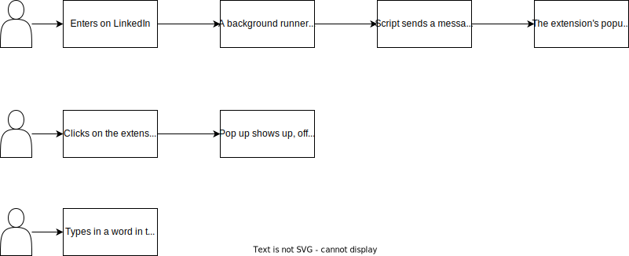

# linkedinPostRemover

I'll be using this project to both learn about developing Google Chrome Extensions and to solve a problem of some connections of mine.

## SIMILAR PROJECTS

I've searched for extensions that solve the exact problem I intend to solve or similar ones, and I found these listed below.
- [LinkOff - Filter and Customizer for LinkedIn™](https://chrome.google.com/webstore/detail/linkoff-filter-and-custom/maanaljajdhhnllllmhmiiboodmoffon?hl=pt-BR)
- [Feedblocker](https://chrome.google.com/webstore/detail/feedblocker/obehkecmojmkiikdffbmnobnnmgikkfa?hl=pt-BR)
- [SimplyFeed - LinkedIn Feed Filter](https://chrome.google.com/webstore/detail/simplyfeed-linkedin-feed/hpjgkdecioodgjhhdoagefbbdlljkpic?hl=pt-BR)

### BEHAVIORS TO CODE

The image below displays the behaviors I want the extension to have.

- [X] BEHAVIOR 1

**Given** that I'm on a LinkedIn page  
**When** I click on the PUZZLE PIECE icon  
**Then** I can see Linkedin Posts Remover's (LPR) icon

- [X] BEHAVIOR 2

**Given** that I've fixed the LPR's icon to my toolbar  
**When** I click on it  
**Then** I can see a pop up containing a input field

- [ ] BEHAVIOR 3

**Given** that opened the LPR popup  
**When** I type in a word and press Enter 
**OR** Click on the `+` button  
**Then** I can see the word below, formated as a tag

- [ ] BEHAVIOR 4

**Given** that opened the LPR popup  
**When** Look at the footbar 
**Then** I can see the icons of Github and Linkedin

- [ ] BEHAVIOR 5

**Given** that I clicked on the GitHub icon  
**Then** I'm taken to the project GitHub repo

- [ ] BEHAVIOR 6

**Given** that I clicked on the Linkedin icon  
**Then** I'm taken to the developers LinkedIn profile